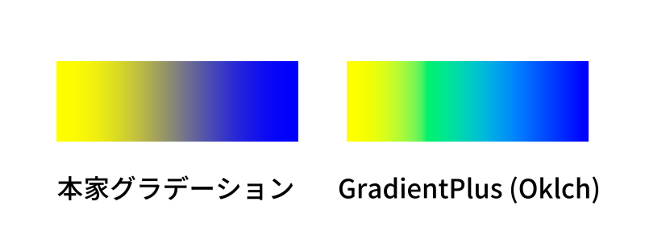
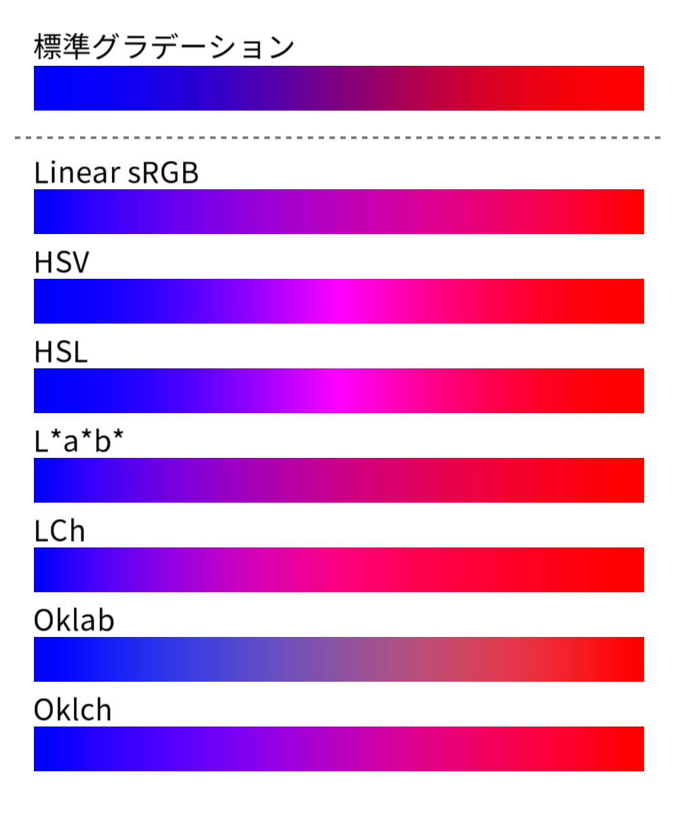
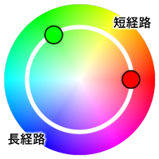
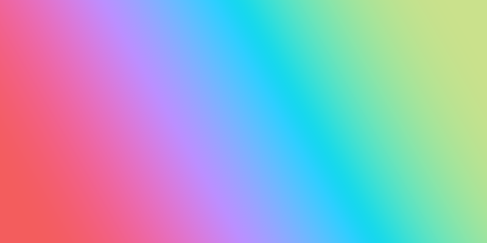

# AviUtl GradientPlus
sRGB 以外の色空間 (Linear sRGB, HSV, HSL, L\*a\*b\*, LCh, Oklab, Oklch) でグラデーションさせる AviUtl スクリプトです。動作には karoterra氏の [GLShaderKit](https://github.com/karoterra/aviutl-GLShaderKit) が必要になります。



## 推奨
- [rikky_module 拡張編集0.92以前用](http://hazumurhythm.com/a/a2Z/)<br>なくても動作しますが、導入すると設定ダイアログの項目をリストボックス化します。

## 導入方法
1. [GLShaderKit](https://github.com/karoterra/aviutl-GLShaderKit) を導入します。
2. `exedit.auf` と同一ディレクトリ(または1層下)にある `script` フォルダに以下のファイルを入れてください。
- `GradientPlus.lua`
- `GradientPlus.anm`
- `GradientPlus.frag`

## 使い方
オブジェクトに `GradientPlus.anm` を適用してください。

## パラメーター

### トラックバー
- #### 中心 X
  中心点から X 方向へのオフセット値。

- #### 中心 Y
  中心点から Y 方向へのオフセット値。

- #### 角度
  グラデーションの角度。

- #### 幅
  グラデーションの幅。標準グラデーションとほぼ同じですが、計算の都合上、円ループで値が非常に小さい場合に発生するモアレやアンチエイリアスなどが微妙に異なります。

### 設定ダイアログ
- #### 強さ
  グラデーションの強さ。`0` ~ `100` の範囲で指定してください。

- #### 合成モード
  合成モードを指定します。項目は標準グラデーションと同じです。
  | 値 | 合成モード |
  |:---|:---|
  | `1` | 通常 |
  | `2` | 加算 |
  | `3` | 減算 |
  | `4` | 乗算 |
  | `5` | スクリーン |
  | `6` | オーバーレイ |
  | `7` | 比較(明) |
  | `8` | 比較(暗) |
  | `9` | 輝度 |
  | `10` | 色差 |
  | `11` | 陰影 |
  | `12` | 明暗 |
  | `13` | 差分 |

- #### 形状
  グラデーションの形状を指定します。項目は標準グラデーションと同じです。
  | 値 | 形状 |
  |:---|:---|
  | `1` | 線 |
  | `2` | 円 |
  | `3` | 四角形 |
  | `4` | 凸形 |
  | `5` | 円ループ |
  | `6` | 四角ループ |
  | `7` | 凸ループ |
  | `8` | 凸ループ2 |

- #### 色空間
    グラデーションする際の色空間を指定します。
  | 値 | 名称 | 簡単な説明 |
  |:---|:---|:---|
  | `1` | Linear&nbsp;sRGB |ガンマを除去した sRGB。|
  | `2` | HSV |Hue(色相)、Saturation(彩度)、Value(明度)からなる色空間。|
  | `3` | HSL|Hue(色相)、Saturation(彩度)、Lightness(輝度)からなる色空間。黒や白とのグラデーションで HSV との違いが顕著に表れる。|
  | `4` | L\*a\*b\*<br>(CIE LAB) |人間の視覚に基づいて色の差が均等に認識できるように設計された色空間。本スクリプトでは D65 を白色点とする。|
  | `5` | LCh | L\*a\*b* の a, b を極座標に変換したもの。 Hue(色相)を回転させながら補間できるため、色の変化がより自然になる。
  | `6` | Oklab |L\*a\*b* の知覚的均等性を改善した色空間。
  | `7` | Oklch |Oklab を極座標に変換したもの。

  **比較画像**
  

- #### 補間経路
  HSV、HSL、LCh、Oklch といった色相を持つ色空間が、色相環上でどのような経路で補間するか指定します。
  | 値 | 経路 |
  |:---:|:---:|
  | `1` | 短経路 |
  | `2` | 長経路 |

  

- #### 開始色
  開始色を指定します。初期値は `0xffffff` です。

- #### 終了色
  終了色を指定します。初期値は `0x000000` です。

- #### 再読込
  有効にするとシェーダーを再読み込みします。

## 関数
このスクリプトに含まれる関数です。外部スクリプトから呼び出すことができます。
```Lua
GradientPlus(
    offset_x,       -- 中心点からX方向へのオフセット値
    offset_y,       -- 中心点からY方向へのオフセット値
    angle,          -- 角度
    width,          -- 幅
    strength,       -- 強さ
    blend_mode,     -- 合成モード
    gradient_type,  -- 形状
    color_space,    -- 色空間
    interp_dir,     -- 補間経路
    color1,         -- 開始色
    color2,         -- 終了色
    reload          -- 再読み込み
)
```

### パラメーター
| 変数名 | 説明 | 型 | 単位 |
|:---|:---|:---|:---|
| offset_x | 中心点から X 方向へのオフセット値 |number | ピクセル|
| offset_y | 中心点から Y 方向へのオフセット値 |number | ピクセル|
| angle | グラデーションの角度 | number | 度 |
| width | グラデーションの幅 | number | ピクセル |
| strength | グラデーションの強さ | number | なし |
| [blend_mode](#合成モード) | 合成モード | number | なし |
| [gradient_type](#形状) | グラデーションの形状 | number | なし |
| [color_space](#色空間) | グラデーションの色空間 | number |なし |
| [interp_dir](#補間経路) | グラデーションの補間経路 | number | なし |
| color1 | 開始色(16進数カラーコード) | number | なし |
| color2 | 終了色(16進数カラーコード) | number | なし |
| reload | シェーダーの再読み込み | boolean | なし |

**例**
```Lua
local GradientPlus = require("GradientPlus")
GradientPlus.GradientPlus(0, 0, 60, 400, 100, 1, 1, 7, 2, 0x1cae18c, 0xf35d5d, false)
```


## ライセンス
[CC0](LICENSE.txt) に基づくものとします。

## 更新履歴
- #### v1.0.1 (2025/3/2)
  ライセンス漏れを修正
- #### v1.0.0 (2025/3/1)
  初版